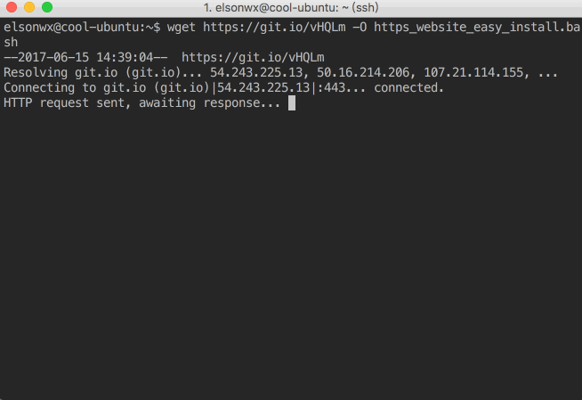

# https_website_easy_install
one command to generate https website on nginx.All you need to do is input your domain names and set your web directory according the terminal prompt.

### Prerequisites

- Port 80 and port 443 has been allowed in your server's firewall rule.

### Usage

- Step 1: install nginx on linux

  - ubuntu/debian

    ````
    $ sudo apt-get update && sudo apt-get -y install nginx
    ````

  - centos/redhat

    ```
    $ sudo yum -y update && sudo yum -y install nginx
    ```

- Step 2: download this script

  ``` 
  $ wget https://git.io/vHQLm -O https_website_easy_install.bash
  ```

- Step 3: generate https website on your linux server

  ```
  $ sudo bash https_website_easy_install.bash
  ```


### Notes

if you just want to generate a http website,you can download the `http_website_easy_install.bash` instead.

```
$ wget https://git.io/vQfud -O http_website_easy_install.bash
```


### Issues

#### No crontab error

This script will create a crontab task to renew your ssl certificate on the 1st of every month.If your server has no crontab,Please install it.(e.g. bandwagonhost minimal ubuntu server,`sudo apt-get install cron` )

#### SELinux cause the nginx 403 error

The SELinux mode may be opened in centos/redhat 6.6 and later,you will fail in the first step to establish a http website.You can check whether the SELinux is enabled in your server through execute `sestatus -v` command.this error can be solved by closing the SELinux simply,you can close the SELinux and restart your server

```
$ sudo sed -i 's/SELINUX=enforcing/SELINUX=disabled/g' /etc/selinux/config
$ sudo init 6
```

or you can solve this problem through these solutions

https://stackoverflow.com/a/26228135

https://www.nginx.com/blog/nginx-se-linux-changes-upgrading-rhel-6-6/#gs.iz_rbNA

#### CentOS/RedHat No package nginx available

you should enable the **EPEL**(*Extra Packages for Enterprise Linux*) repository or install nginx by other ways.

[How to enable EPEL repository](https://www.liquidweb.com/kb/enable-epel-repository/)

[Amazon EC2 enable EPEL](https://aws.amazon.com/cn/premiumsupport/knowledge-center/ec2-enable-epel/)


### Screenshot




###  Inspired

[Let's Encrypt](https://letsencrypt.org)

[diafygi/acme-tiny](https://github.com/diafygi/acme-tiny)


